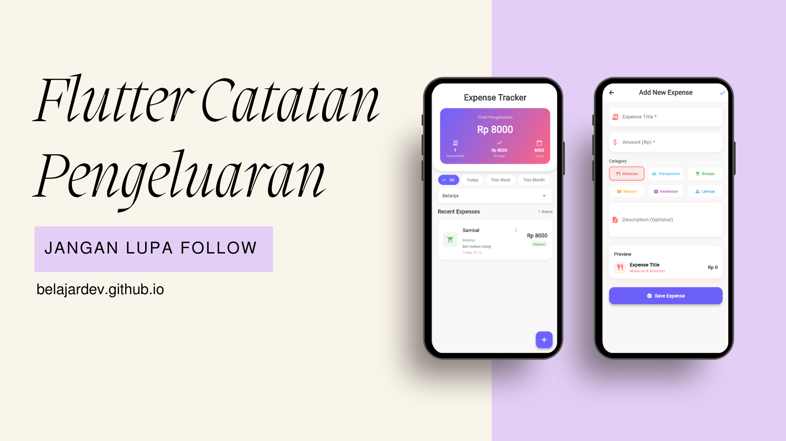

# 📱 Expense Tracker - Flutter

<p align="center">
  
</p>

Aplikasi pencatat pengeluaran yang indah dan modern untuk mengatur keuangan Anda.

## ✨ Fitur Utama

💰 **Catat Pengeluaran** - Tambah dan kategori pengeluaran  
🎨 **Kategori Berwarna** - 6 warna berbeda untuk kategori  
📊 **Statistik Real-time** - Total, rata-rata, dan pengeluaran hari ini  
🔍 **Filter Pintar** - Filter berdasarkan waktu dan kategori  
🗑️ **Hapus Mudah** - Hapus pengeluaran dengan konfirmasi  
📅 **Format Tanggal** - Tampilan tanggal yang mudah dibaca

## 🚀 Mulai Cepat

```bash
# Clone repository
git clone https://github.com/belajardev/flutter-expense-tracker.git

# Masuk direktori
cd flutter-expense-tracker

# Install dependencies
flutter pub get

# Jalankan aplikasi
flutter run
```

## 📁 Struktur Proyek

```
lib/
├── main.dart                 # Entry point aplikasi
├── models/expense.dart       # Model data pengeluaran
├── screens/
│   ├── home_screen.dart      # Dashboard utama
│   └── add_expense_screen.dart # Form tambah pengeluaran
└── widgets/expense_card.dart # Komponen kartu pengeluaran
```

## 📱 Cara Menggunakan

1. **Tambah Pengeluaran**: Tap tombol + di pojok kanan bawah
2. **Isi Data**: Judul, jumlah, pilih kategori, deskripsi (opsional)
3. **Simpan**: Tap tombol Save Expense
4. **Lihat**: Semua pengeluaran ditampilkan di dashboard
5. **Filter**: Gunakan filter waktu (All, Today, Week, Month) atau kategori

## 🎨 Kategori

1. **Makanan & Minuman** 🍔 - Merah
2. **Transportasi** 🚗 - Biru
3. **Belanja** 🛍️ - Hijau
4. **Hiburan** 🎬 - Oranye
5. **Kesehatan** 🏥 - Ungu
6. **Lainnya** 📦 - Biru Muda

## 📸 Tampilan Aplikasi

| Dashboard                                                                      | Tambah Data                                                              | Daftar Pengeluaran                                                       |
| ------------------------------------------------------------------------------ | ------------------------------------------------------------------------ | ------------------------------------------------------------------------ |
|  |  |  |

## 🤝 Berkontribusi

1. Fork repository
2. Buat branch fitur (`git checkout -b fitur-baru`)
3. Commit perubahan (`git commit -m 'Tambahkan fitur'`)
4. Push ke branch (`git push origin fitur-baru`)
5. Buat Pull Request

## 📄 Lisensi

MIT License - Lihat file [LICENSE](LICENSE)

## 👤 Penulis

**Nama Anda**  
📧 Email: email@belajardev.com  
🐙 GitHub: [@belajardev](https://github.com/belajardev)

## 🌟 Dukung Proyek Ini

Beri ⭐ di repository jika proyek ini membantu!

---

**Dibuat dengan ❤️ menggunakan Flutter**

Selamat Mengatur Keuangan! 💰✨
